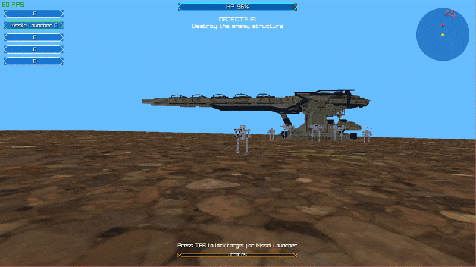

# NEPTUNE'S SPEAR

> Projeto de mecha 3D em primeira pessoa desenvolvido em C puro com Raylib, focado em arquitetura de engine em baixo nível: ECS próprio, gerenciamento explícito de recursos e sistemas modulares coordenados por gerenciadores centrais.

[Versão em inglês](./README.md)


---
## Preview


*Travando um alvo e disparando uma salva de mísseis guiados do mecha do jogador.*


*Encontro no segundo nível mostrando o ambiente 3D e o mecha inimigo.*


*Layout do menu principal com visualização 3D do mecha e opções de navegação.*

## Sobre

NEPTUNE'S SPEAR é, antes de tudo, um projeto de programação sobre como estruturar um pequeno jogo 3D de mecha em primeira pessoa em C. As mecânicas básicas de FPS existem principalmente para exercitar a arquitetura: um sistema ECS próprio, máquinas de estado explícitas para o comportamento dos inimigos, sistemas desacoplados (renderização, movimento, combate, HUD) e gerenciadores centralizados para recursos, eventos e estado de jogo.

Este projeto foi desenvolvido como trabalho final para a disciplina de Programação Imperativa (CIN0005/06) do Centro de Informática da UFPE.

## Tecnologias

### Desenvolvimento
- **C (C99)**
- **Raylib 5.6-dev** (gráficos e áudio)
- **Raymath** (operações 3D)
- **Make** (build)

### Assets
- **Blender**: modelagem 3D e animações
- **Audacity**: edição de áudio e efeitos sonoros

## Requisitos

### Linux

```bash
sudo apt-get update
sudo apt-get install build-essential libgl1-mesa-dev libx11-dev libxrandr-dev libxi-dev libxcursor-dev libxinerama-dev libasound2-dev
```

### Windows

- MinGW-w64 ou Visual Studio
- OpenGL 3.3+
- Bibliotecas de áudio do Windows

### macOS

```bash
brew install raylib
```

## Instalação

1. Clone o repositório:

```bash
git clone https://github.com/rafaelvlt/raylib-mecha-cin0005.git
cd raylib-mecha-cin0005
```

2. Inicialize os submódulos:
```bash
git submodule update --init --recursive
```

Observação: alternativamente, você pode clonar já inicializando submódulos:
```bash
git clone --recurse-submodules https://github.com/rafaelvlt/raylib-mecha-cin0005.git
```

3. Compile o Raylib primeiro:

```bash
cd lib/raylib/src
make PLATFORM=PLATFORM_DESKTOP
cd ../../..
```

4. Compile e execute o jogo:

```bash
make run
```

## Como Jogar

### Controles

#### Movimento
- **W / Seta para Cima**: Mover para frente/trás
- **A / D ou Setas Esquerda/Direita**: Girar o mecha
- **Mouse**: Rotacionar torso e mira (independente das pernas)

#### Combate
- **Botão Esquerdo do Mouse**: Atirar
- **Botão Direito do Mouse**: Zoom
- **1, 2, 3, 4, 5**: Alternar grupos de armas
- **TAB**: Lock-on (travar alvo)

#### Utilidades
- **C**: Centralizar torso nas pernas
- **F**: Centralizar pernas no torso

## Autores

Projeto desenvolvido como trabalho final para a disciplina de Programação Imperativa (CIN0005/06) do Centro de Informática da UFPE.

<table>
  <tr>
    <td align="center">
      <a href="https://github.com/rafaelvlt">
        
        <br />
        <sub><b>Rafael Barbosa</b></sub>
      </a>
      <br />
      <a href="https://github.com/rafaelvlt" title="GitHub">@rafaelvlt</a>
    </td>
    <td align="center">
      <a href="https://github.com/RodrigoSilveiraCin">
        
        <br />
        <sub><b>Rodrigo Silveira</b></sub>
      </a>
      <br />
      <a href="https://github.com/RodrigoSilveiraCin" title="GitHub">@RodrigoSilveiraCin</a>
    </td>
    <td align="center">
      <a href="https://github.com/IrineuACgasoso">
        
        <br />
        <sub><b>Caio Amarante</b></sub>
      </a>
      <br />
      <a href="https://github.com/IrineuACgasoso" title="GitHub">@IrineuACgasoso</a>
    </td>
    <td align="center">
      <a href="https://github.com/ARISE21">
        
        <br />
        <sub><b>Eric Santiago</b></sub>
      </a>
      <br />
      <a href="https://github.com/ARISE21" title="GitHub">@ARISE21</a>
    </td>
    <td align="center">
      <a href="https://github.com/HebSP">
        
        <br />
        <sub><b>Heberty Pinto</b></sub>
      </a>
      <br />
      <a href="https://github.com/HebSP" title="GitHub">@HebSP</a>
    </td>
  </tr>
</table>

## Licença

Este projeto está sob a licença especificada no arquivo `LICENSE`.
